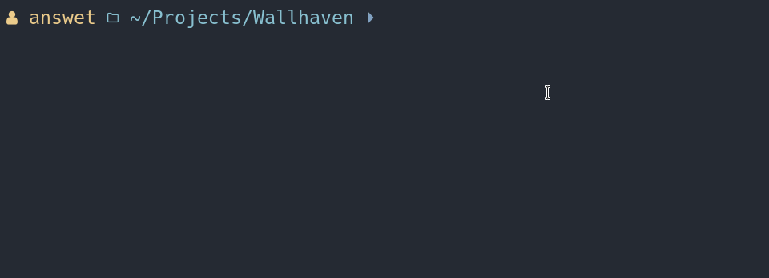

# wallhaven-downloader

This script downloads all wallpapers from a [Wallhaven](https://wallhaven.cc/) user's collection.

All wallpapers are saved in a folder with the name of the respective collection, this folder will be created in `Pictures/Wallpapers`.

## How to Use:
Pass as argument the user owner of the collection
```
$ ./app.py <username>
```

The collections belonging to the user will be listed, just indicate the number of the collection you want to download.



## Dependencies:
This script depends on the Requests module.
You can install the requirements by running this command:
```
$ pip install -r requirements.txt
```
